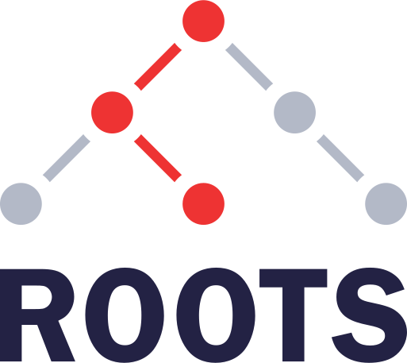

<p align="center"></p>

# Roots

This is a client-side router for Svelte that uses history mode. It's in early developement so expect bugs, changes, and dragons.

### Features
* Lightweight (aprox 3kB gzip)
* No dependencies (other than Svelte)
* Uses history API and native links for navigation
* Multiple options to manage scrolling
* Can compose nested components at the route definition

Demo app: https://roots-router-demo.netlify.app/

To install:

```
npm i roots-router
```

## Simple example

### `App.svelte`
```svelte
<script>
  import {RouterView, initRouter} from 'roots-router';

  import Home from './Home.svelte';
  import About from './About.svelte';
  import Contact from './Contact.svelte';
  import Error from './Error.svelte';
  import Menu from './Menu.svelte';

  const config = {
    notFoundComponent: Error,
    routes: [
      { path: '/', component: Home },
      { path: '/about', component: About },
      { path: '/contact', component: Contact }
    ]
  }

  initRouter(config);
</script>

<Menu/>
<RouterView/>
```

### `Menu.svelte`
```svelte
<script>
  import {link, active} from 'roots-router';
</script>

<nav>
  <a href="/" use:link use:active>Home</a>
  <a href="/about" use:link use:active>About</a>
  <a href="/contact" use:link use:active>Contact</a>
</nav>
```

## More complex router config example

This example is taken from the [demo app](demo-app/src/router.js).

```js
// Router configuration object
{
  notFoundComponent: Error,
  onRouteMatch: (from, to) => {
    // If the route is not private, just return true and let the router continue
    if (!to.meta.isPrivate) return true;

    if (isAuthenticated) {
      return true;
    } else {
      navigate({
        path: '/login',
        replace: true
      });
    }
  },
  routes: [
    { path: '/', component: Home },
    { path: '/login', component: Login },
    { path: '/about', component: About },
    { path: '/about/some-modal', components: [About, Modal], blockPageScroll: true },
    { path: '/hello/:name', component: Hello },
    {
      path: '/nested',
      component: Nested,
      children: [
        { component: DefaultChild },
        {
          path: 'child-a',
          component: ChildA,
          children: [
            {component: GrandchildA }
          ]
        },
        { path: 'child-b', component: ChildB }
      ]
    },
    {
      path: '/private',
      component: Private,
      meta: {
        isPrivate: true
      }
    },
  ]
}
```
this configuration will produce the following available paths:
```
/
/login
/about
/about/some-modal
/hello/:name
/nested
/nested/child-a
/nested/child-b
/private
```

## The `RouterView` component

This component simply renders the current route and nested routes. It does not contain any logic or state. You can freely add it, remove it, or move it around as you see fit. This will not change the state of the router.

For example this could be your `App.svelte` component:

```svelte
<script>
  import {onMount} from 'svelte';
  import {RouterView} from 'roots-router';
  import Spinner from './Spnner.svelte';
  import {fetchIntialData} from 'api';

  let initialData;

  onMount(async () => {
    initialData = await fetchIntialData();
  });
</script>

{#if initialData}
  <RouterView/>
{:else}
  <Spinner/>
{/if}
```

## Configuring routes
The most basic route must have at least a `path` and a `component` reference:
```js
{ path: '/about', component: About }
```

### Path paramaters

```js
{ path: '/products/:productId', component: ProductDetail }
```

Path parameters will be available in the `params` object of the `currentRoute` store:

```svelte
<script>
  import {currentRoute} from 'roots-router';
  console.log($currentRoute.params);
</script>
```

### Meta data

You can also add a `meta` object to your routes with custom data. You can read this data from the `onRouteMatch` hook, or from the `currentRoute` store:

```js
{
  path: '/private',
  component: Private,
  meta: {
    isPrivate: true
  }
}
```

### Nested routes
You can add nested routes using the `children` array:
```js
{
  path: '/characters',
  component: Characters,
  children: [
    { path: '/yoda', component: Yoda },
    { path: '/han-solo', component: HanSolo },
  ]
}
```
These routes will produce two available paths:
* `/characters/yoda`
* `/characters/han-solo`

The router will render child routes in the default slot of the parent component:
```svelte
// Characters.svelte
<h1>Star Wars Characters</h1>
<slot></slot>
```

When matching the path `/characters/yoda`, the `Yoda` component will be rendered inside `Characters`.

It's possible to add a default first child without a path:

```js
{
  path: '/characters',
  component: Characters,
  children: [
    { component: CharacterList },
    { path: '/yoda', component: Yoda },
    { path: '/han-solo', component: HanSolo },
  ]
}
```
Now there will be three paths available:
* `/characters` which will render the default `CharacterList` inside `Characters`
* `/characters/yoda`
* `/characters/han-solo`


### Composing nested components
Nested components can be composed right from the router by using the `components` array:

```js
{ path: '/some-path', components: [Parent, Child] }
````

Just as with nested routes, this will render the `Child` component in the default slot of the `Parent` component.

This feature is useful for using components as layouts, nesting layouts, or integrating modals with the router. For example, when you want deep linking on modals, or you'd like a modal to close when pressing back:

```js
// Layout
{ path: '/home', components: [AppLayout, ShellLayout, Home] },

// Picture modal
{ path: '/photos', components: [Photos] },
{ path: '/photos/:photoId', components: [Photos, PhotoDetailModal], blockPageScroll: true }
````

See the [demo app](demo-app/src/components/About.svelte) for an example on using modals that integrate with the router.

## Links

In most cases, the recommended approach for navigation is using standard HTML links with the provided actions.

### `link` action

To trigger route changes use the `link` action:

```svelte
<script>
  import {link} from 'roots-router';
</script>

<!-- Simple navigation -->
<a href="/about" use:link>About</a>

<!-- Navigate without scrolling to the top -->
<a href="/some/nested/path" use:link={{scrollToTop: false}}>Some tab section</a>

<!-- Navigate and then scroll to an element with an id -->
<a href="/user/settings" use:link={{scrollToId: 'password-form'}}>Set your password</a>
```

The `link` action will be totally bypassed on clicks with modifiers (Alt, Control, etc) to maintain native behavior.

### `active` action
To highlight an active link use the `active` action.

By default, this will add the `active` CSS class to the element, but you can configure it to use a different class.

```svelte
<script>
  import {link, active} from 'roots-router';
</script>

<!-- Will mark as active if the router is on /about -->
<a href="/about" use:link use:active>About</a>

<!-- Mark as active if the href also matches the start of the current path eg: /products/123456/reviews -->
<a href="/products" use:link use:active={{matchStart: true}}>Products</a>
```

#### Custom active CSS class

You can define a custom default active CSS class using the `activeClass` setting in the router configuration, or in the action settings:

```svelte
<!-- Use a custom CSS class -->
<a href="/about" use:link use:active={{activeClass: 'is-active'}}>About</a>
```

#### `aria-current` value

By default, the `active` action will add `aria-current="page"` on an active link. You can customize this value depending on your use case:

```svelte
<!-- Use a custom CSS class -->
<a href="/about" use:link use:active={{ariaCurrent: 'location'}}>About</a>
```

See the [MDN docs](https://developer.mozilla.org/en-US/docs/Web/API/Element/ariaCurrent) for more info on the `aria-current` attribute.

## Programmatic navigation

Since this router uses the history API, to go back and forward you can simply use:

```js
// Go back
window.history.back();

// Go forward
window.history.forward();
```

### `navigate()`

```js
import {navigate} from 'roots-router';

// Navigate to a path
navigate('/about');

// Navigate and replace current history item instead of pushing a new route
navigate({
  path: '/about',
  replace: true
});

// Navigate but don't add the change to the history
navigate({
  path: '/about',
  addToHistory: false
});

// Navigate but don't scroll to the top
navigate({
  path: '/about',
  scrollToTop: false
});

// Navigate and scroll to an id afterwards
navigate({
  path: '/user/settings',
  scrollToId: 'password-form'
});
```

## Scrolling

By default, every route change will scroll to the top left of the page. This can be avoided in three ways:

1. Set `scrollToTop` to `false` on the initial configuration of the router.
2. Add a configuration to the `link` action `<a href="/about" use:link={{scrollToTop: false}}>About</a>`.
3. Set `blockPageScroll` to `true` on a route configuration which will remove the scroll when rendering the route.

Scroll configuration and positions are restored when going back and forward.

### How to enable or disable smooth scrolling?
This router is agnostic to the scrolling behavior. You should respect a user's [`prefers-reduced-motion`](https://developer.mozilla.org/en-US/docs/Web/CSS/@media/prefers-reduced-motion) setting via CSS. See [how Boostrap does it](https://github.com/twbs/bootstrap/blob/644afc276169fd94ee2e6c5c79df8337be1b12ed/scss/_reboot.scss#L28-L36) for example.

## Query string parameters

If there are querystring parameters in the URL, you will be able to read them from the `query` object of the `currentRoute` store:

```svelte
<script>
  import {currentRoute} from 'roots-router';
  console.log($currentRoute.query);
</script>
```

You can also set parameters to the URL without triggering a page change by using the `addQueryParamsToUrl` utility function:

```svelte
<script>
import {addQueryParamsToUrl} from 'roots-router';

function addParams () {
  addQueryParamsToUrl({
    name: 'Pepito',
    food: 'tacos'
    });
  }
</script>

<button type="button" on:click={addParams}>Add params to query string</button>
```

## `onRouteMatch` hook

This router has a single global hook which is triggered when `navigate()` is used from the `link` action, or from programmatic navigation. The hook won't be triggered when going back or forward.

In your router configuration add a `onRouteMatch` sync function. If your hook function returns a truthy value, navigation will continue as usual. If it returns any falsy value, the router will simply stop the navigation request. It's up to you to navigate to another route if you wish to do so.

```js
// Router configuration object
{
  onRouteMatch: (from, to) => {
    console.log('onRouteMatch:');
    console.log('From', from);
    console.log('To', to);

    // If the route is public, return true and let the router continue doing its thing
    if (to.meta.isPublic) return true;

    // Or else check if the user is authenticated
    if (isAuthenticated()){
      return true;
    } else {
      navigate({
        path: '/login',
        replace: true
      });
    }
  },
  routes: [
  ]
}
```

By design, this hook has to be a **sync** function. If you return a promise it will be ignored. Native promises cannot be cancelled and we didn't want to bloat the router with custom promise cancelation features. We also think a router should be agnostic in this matter.

If you need to perform async logic before entering a route, do so before triggering the route change. This way you'll have total control on how to cancel pending promises if the user triggers a navigation change before the promise has resolved. Then you can do this:

```js
// Router configuration object
{
  onRouteMatch: (from, to) => {
    cancelPendingPromises();
    return true;
  }
}
```

## Base path
If your application is running in a folder you can configure the `basePath` setting in the router options. For example if your app is runing in `/some/folder/` you can set:

```js
// Router configuration object
{
  basePath: '/some/folder/'
}
```

The first and last slashes are optional.

Once the router inits, this base path will be added automatically to all available routes. You don't need to add the base path when using the `navigate()` function or to the links using the `link` action, although if you do, nothing bad will happen.

## API
### Router configuration options

* `notFoundComponent` a component reference that will be rendered if there are no matched routes.
* `notFoundComponents` an array of component references that will be rendered if there are no matched routes.
* `activeClass` the default CSS class that will be applied to active links that use the `active` action.
* `scrollToTop` determines if the scroll should be set to the top left when transitioning to a new route. The default is `true`.
* `manageScroll` if set to `false` all scrolling features of the router will be ignored. The default is `true`.
* `onRouteMatch` a sync function that will be triggered whenever a path matches a route.
* `basePath` a base path that will be automatically added to all routes and links using the `link` action. The first and last slashes are optional.


### Route configuration options
* `path` the path of the route.
* `component` the component that will be rendered when the path is matched.
* `components` the component tree that will be rendered when the path is matched.
* `children` an array of children routes.
* `blockPageScroll` whether to removing the scrolling capability of the `body` element by setting `overflow: hidden;`.
* `meta` and object with values that can be read from hooks or the `currentRoute` store.

### `navigate()` options
* `path` the path that will be used to match a route.
* `scrollToTop` determines if the scroll should be set to the top left after transitioning to the next route. The default is `true`.
* `scrollToId` scroll to an element with an `id` after transitioning to the next route.
* `replace` replace the current item in history instead of adding a new one. The default is `false`.
* `addToHistory` add item to history after navigation. The default is `true`.

### `link` action options
* `scrollToTop` determines if the scroll should be set to the top left after transitioning to the next route. The default is `true`.
* `scrollToId` scroll to an element with an `id` after transitioning to the next route.

### `active` action options
* `matchStart` mark a link as active if the `href` value matches the start of the current path.
* `activeClass` the CSS class that will be applied to the link if marked as active. The default is `active`.
* `ariaCurrent` the value of the `aria-current` attribute that will be added to the link if marked as active.  The default is `page`.

## FAQ

## Roadmap

Features that will be implemented in the not-so-distant future:

* Route data cache
* More hooks (probably)

Features that will be implemented for the `1.0.0` release:

* TypeScript
* Code splitting

Features that will not be implemented:

* Nested routers